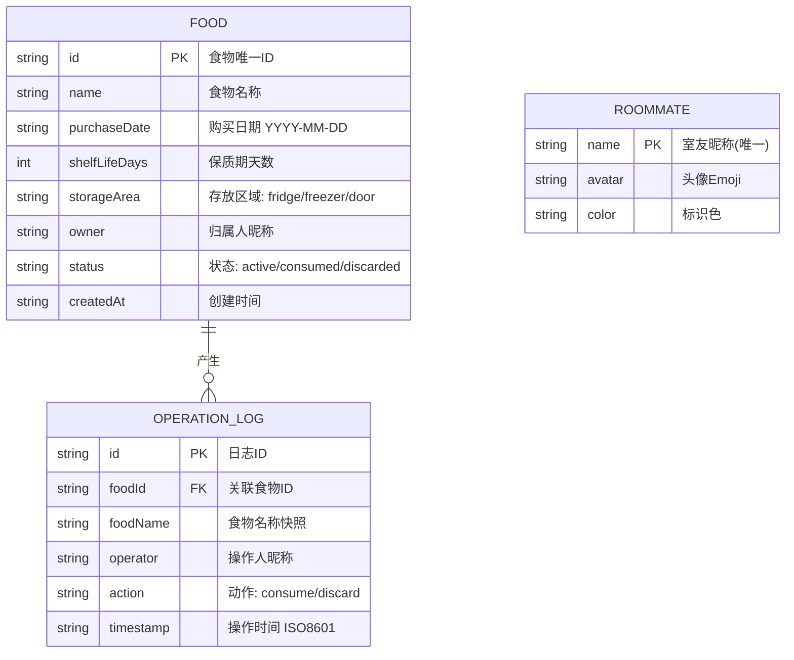

## 1. 架构设计

本系统采用纯前端架构，所有数据存储于浏览器 LocalStorage，无需后端服务即可完整运行。架构分为三层：展示层负责 UI 渲染与交互，状态管理层负责数据驱动，持久层负责本地存储读写。


## 2. 技术选型说明

- **前端框架**：React 18 + TypeScript，提供类型安全和组件化开发
- **构建工具**：Vite 5，开发体验好，构建速度快
- **样式方案**：TailwindCSS 3，原子化 CSS，快速构建 UI
- **状态管理**：React Context + useReducer，轻量级状态管理，适合中小型应用
- **数据持久化**：浏览器 LocalStorage API，无需后端，开箱即用
- **日期处理**：原生 Date API + 自定义工具函数，避免引入额外依赖
- **图标方案**：Heroicons + Emoji，兼顾功能图标与视觉亲和力

## 3. 路由定义

本项目为单页应用 (SPA)，使用 HashRouter 管理路由：

| 路由路径 | 页面用途 |
|----------|----------|
| `/` | 首页看板（默认路由）：食物分组展示、统计、筛选、操作入口 |
| `/logs` | 操作日志页面：历史操作记录时间线、筛选查询 |

## 4. 数据模型

### 4.1 实体关系图



### 4.2 LocalStorage 数据结构

**存储键名前缀**: `fridge-manager-`

| 键名 | 数据类型 | 说明 |
|------|----------|------|
| `fridge-manager-foods` | Food[] | 活跃食物列表（status=active） |
| `fridge-manager-logs` | OperationLog[] | 操作日志列表 |
| `fridge-manager-roommates` | Roommate[] | 室友列表 |
| `fridge-manager-current-user` | string | 当前选中的室友昵称 |

### 4.3 TypeScript 类型定义

```typescript
// 存放区域类型
type StorageArea = 'fridge' | 'freezer' | 'door';

// 食物状态类型
type FoodStatus = 'active' | 'consumed' | 'discarded';

// 操作动作类型
type ActionType = 'consume' | 'discard';

// 新鲜度状态
type FreshnessStatus = 'expired' | 'expiring' | 'fresh';

// 食物实体
interface Food {
  id: string;
  name: string;
  purchaseDate: string;
  shelfLifeDays: number;
  storageArea: StorageArea;
  owner: string;
  status: FoodStatus;
  createdAt: string;
}

// 操作日志
interface OperationLog {
  id: string;
  foodId: string;
  foodName: string;
  operator: string;
  action: ActionType;
  timestamp: string;
}

// 室友信息
interface Roommate {
  name: string;
  avatar: string;
  color: string;
}

// 表单数据
interface FoodFormData {
  name: string;
  purchaseDate: string;
  shelfLifeDays: number;
  storageArea: StorageArea;
  owner: string;
}
```

## 5. 目录结构

```
src/
├── components/              # 可复用组件
│   ├── layout/             # 布局组件
│   │   ├── Header.tsx      # 顶部导航栏
│   │   └── StatsCards.tsx  # 统计卡片
│   ├── food/               # 食物相关组件
│   │   ├── FoodCard.tsx    # 食物卡片
│   │   ├── FoodColumn.tsx  # 分组列
│   │   ├── FoodForm.tsx    # 新增表单
│   │   └── ConfirmModal.tsx# 操作确认弹窗
│   ├── logs/               # 日志相关组件
│   │   ├── LogItem.tsx     # 日志条目
│   │   └── LogDrawer.tsx   # 日志抽屉
│   └── common/             # 通用组件
│       ├── Badge.tsx       # 徽章标签
│       ├── Button.tsx      # 按钮
│       └── Modal.tsx       # 弹窗容器
├── hooks/                  # 自定义 Hooks
│   ├── useFoods.ts         # 食物数据管理
│   ├── useLogs.ts          # 日志管理
│   └── useFreshness.ts     # 新鲜度计算
├── utils/                  # 工具函数
│   ├── storage.ts          # LocalStorage 封装
│   ├── date.ts             # 日期处理
│   └── id.ts               # ID 生成器
├── context/                # Context 定义
│   └── AppContext.tsx      # 全局状态
├── types/                  # 类型定义
│   └── index.ts            # 所有类型声明
├── data/                   # 预置数据
│   └── mock.ts             # Mock 初始数据
├── pages/                  # 页面组件
│   ├── Dashboard.tsx       # 首页看板
│   └── Logs.tsx            # 日志页面
├── App.tsx                 # 根组件
├── main.tsx                # 入口文件
└── index.css               # 全局样式 + Tailwind 配置
```

## 6. 核心业务逻辑说明

### 6.1 新鲜度算法 (useFreshness Hook)

```
输入: purchaseDate(购买日期), shelfLifeDays(保质期天数)
输出: FreshnessStatus + 剩余天数

计算步骤:
1. 过期日期 = purchaseDate + shelfLifeDays
2. 剩余天数 = floor(过期日期 - 今天) / 86400000
3. 判断:
   - 剩余天数 <= 0 → expired (过期)
   - 剩余天数 <= 2 → expiring (临期)
   - 否则 → fresh (正常)
```

### 6.2 数据持久化策略

- **写入时机**：每次增删改操作后立即同步到 LocalStorage
- **读取时机**：应用初始化时从 LocalStorage 加载，无数据则加载 Mock 默认数据
- **数据一致性**：使用 React Context 集中管理，保证多组件数据同步
- **容错处理**：LocalStorage 读写异常时降级为内存存储，并在控制台输出警告

### 6.3 组件通信架构

使用单一 Context + Reducer 模式：
- `AppContext` 提供 foods、logs、roommates、currentUser 及 dispatch
- 子组件通过 `useContext` 读取数据，调用 dispatch 触发状态变更
- 异步操作（如存储写入）在自定义 Hook 中完成后再 dispatch action
