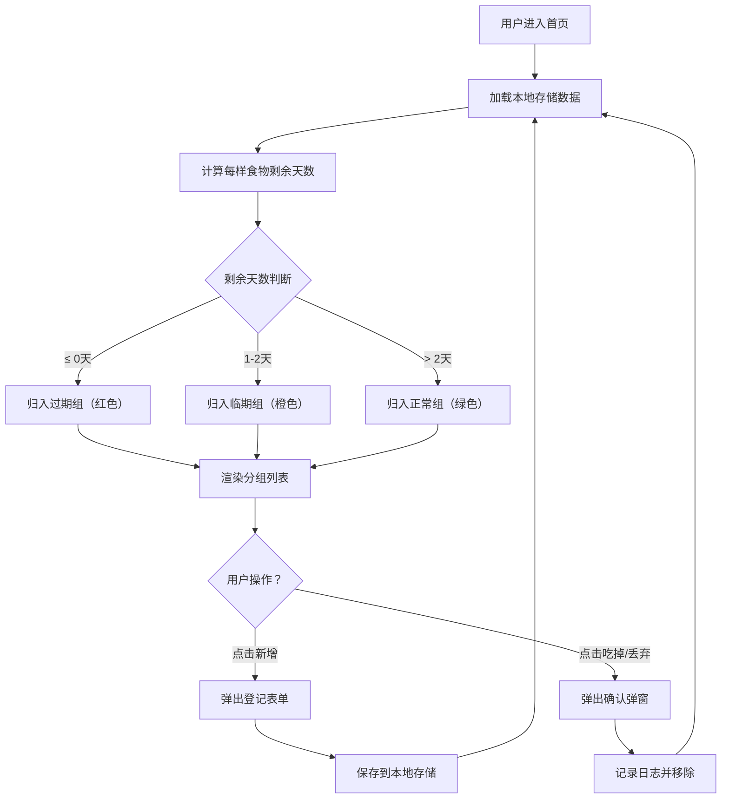

## 1. 产品概述

合租冰箱食物共享管家系统是一款面向合租室友的冰箱食物管理工具，旨在解决合租场景下食物归属混乱、过期浪费、无人清理等痛点问题。通过数字化登记、智能过期提醒和操作日志追踪，让冰箱管理变得透明高效。

- 核心目标：减少食物浪费，明确食物归属，建立室友间的信任机制
- 目标用户：合租室友、集体宿舍成员、共享厨房使用者
- 产品价值：降低生活成本，培养良好的食材管理习惯，减少室友矛盾

## 2. 核心功能

### 2.1 用户角色

| 角色 | 登录方式 | 核心权限 |
|------|----------|----------|
| 室友用户 | 首次使用输入昵称 | 录入食物、查看列表、标记吃掉/丢弃、查看日志 |

### 2.2 功能模块

1. **首页看板**：食物分组展示（过期/临期/正常）、归属人筛选、统计概览
2. **食物登记模块**：新增食物表单（名称、购买日期、保质期、存放区域、归属人）
3. **食物操作模块**：标记已吃掉、标记已丢弃、操作确认
4. **操作日志模块**：历史操作记录展示、按人筛选、时间倒序

### 2.3 页面详情

| 页面名称 | 模块名称 | 功能描述 |
|----------|----------|----------|
| 首页看板 | 顶部导航 | Logo展示、室友切换、新增食物按钮 |
| 首页看板 | 统计卡片 | 显示总数量、临期数、过期数三类统计 |
| 首页看板 | 归属人筛选 | 下拉选择按室友筛选食物列表 |
| 首页看板 | 过期分组 | 红色卡片展示已过期食物列表 |
| 首页看板 | 临期分组 | 橙色卡片展示≤2天临期食物列表 |
| 首页看板 | 正常分组 | 绿色卡片展示正常食物列表 |
| 首页看板 | 食物卡片 | 显示名称、归属人、剩余天数、存放区域、操作按钮 |
| 新增弹窗 | 表单区域 | 食物名称输入、日期选择、保质期输入、区域选择、归属人选择 |
| 新增弹窗 | 提交按钮 | 校验表单并保存数据 |
| 操作确认弹窗 | 确认区域 | 显示操作类型、食物信息，确认或取消 |
| 日志面板 | 日志列表 | 时间倒序展示所有操作记录（谁、何时、对什么做了什么） |
| 日志面板 | 筛选区域 | 按操作人、操作类型筛选日志 |

## 3. 核心流程

### 3.1 食物登记流程
用户点击"新增食物"按钮 → 弹出登记表单 → 填写食物名称、选择购买日期、输入保质期天数、选择存放区域、选择归属人 → 点击保存 → 表单校验 → 数据存入本地存储 → 刷新首页列表 → 显示成功提示

### 3.2 食物处理流程
用户在首页找到目标食物卡片 → 点击"吃掉"或"丢弃"按钮 → 弹出确认弹窗 → 用户确认 → 记录操作日志（操作人、时间、动作、食物信息） → 食物从活跃列表移除 → 更新统计数据 → 显示操作成功提示

### 3.3 过期提醒流程
页面加载 → 遍历所有活跃食物 → 根据购买日期+保质期计算到期日 → 与当前日期对比 → 自动分类为"过期/临期/正常" → 按分组渲染到对应区域 → 不同状态使用不同颜色视觉区分

## 4. 用户界面设计

### 4.1 设计风格
- **主色调**：清新薄荷绿 (#3EB489) 代表新鲜健康，搭配暖橙色 (#FF8C42) 表示临期提醒，深红色 (#E63946) 表示过期警告
- **辅助色**：浅灰蓝背景 (#F5F7FA)，白色卡片，柔和阴影
- **按钮风格**：圆角胶囊按钮 (border-radius: 9999px)，悬停有轻微上浮和阴影加深效果
- **字体选择**：标题使用 "Noto Sans SC" 粗体，正文使用 "PingFang SC" / "Microsoft YaHei" 常规
- **布局风格**：卡片式栅格布局，顶部固定导航，内容区三列分组
- **图标风格**：使用 Emoji 图标增强亲和力（🍎🥛🥩🧊），搭配线性 SVG 功能图标

### 4.2 页面设计概述

| 页面名称 | 模块名称 | UI 元素 |
|----------|----------|----------|
| 首页看板 | 顶部导航 | 左侧Logo（冰箱图标+产品名）、右侧室友选择器、新增按钮（渐变绿+悬浮阴影） |
| 首页看板 | 统计卡片区 | 三个并排卡片：总数（蓝）、临期（橙）、过期（红），带数字动画 |
| 首页看板 | 筛选栏 | 归属人下拉选择、日志面板切换按钮 |
| 首页看板 | 分组展示区 | 三列布局，每列带分组标题和计数徽章，卡片按时间排序 |
| 首页看板 | 食物卡片 | 食物名（大字体）、归属人标签、剩余天数（大号彩色数字）、存放区域标签、底部两个操作按钮 |
| 新增弹窗 | 表单弹窗 | 半透明遮罩 + 白色圆角弹窗，表单字段带图标前缀 |
| 操作确认弹窗 | 确认弹窗 | 带警告图标的确认框，操作按钮颜色区分（吃掉=绿，丢弃=灰） |
| 日志面板 | 侧边抽屉 | 右侧滑出面板，时间线样式日志列表，每条记录带用户头像、动作标签、时间戳 |

### 4.3 响应式设计
- **桌面端优先**：1280px 以上三列并排展示，1024px 两列，768px 以下单列堆叠
- **交互优化**：移动端按钮增大触控区域（最小 44px），弹窗改为底部弹出（Action Sheet）
- **性能考虑**：卡片懒渲染，动画使用 CSS Transform 避免重排

### 4.4 动效设计
- 页面加载：卡片交错淡入（staggered fade-in，每张延迟 50ms）
- 新增食物：卡片从顶部滑入 + 轻微弹性效果
- 移除食物：卡片向右滑出并淡出，同时统计数字动画更新
- 悬停效果：卡片轻微上浮 (translateY(-2px))，阴影加深
- 弹窗出现：背景渐显 + 弹窗缩放进入（scale 0.95 → 1）
